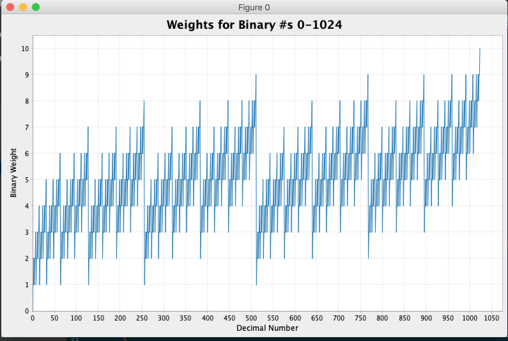

Outputs:

- Q2 Plot:

- Q3 Answer:
moved(1000000, 100, 107) = 990600.0

- Shortest Path:
   From HW4 file:
       graph.shortestPath("X", "F") = ListBuffer(X, J, F)
       graph.shortestPath("X", "C") = N/A (Ran out of time to debug)
       Code works so far for simple cases. 